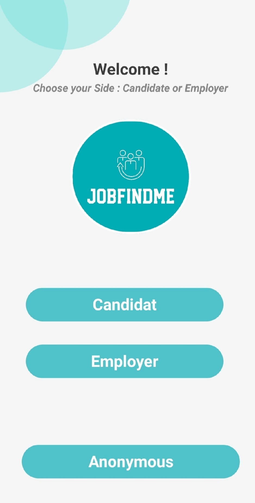
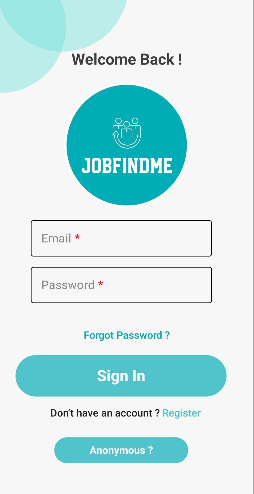
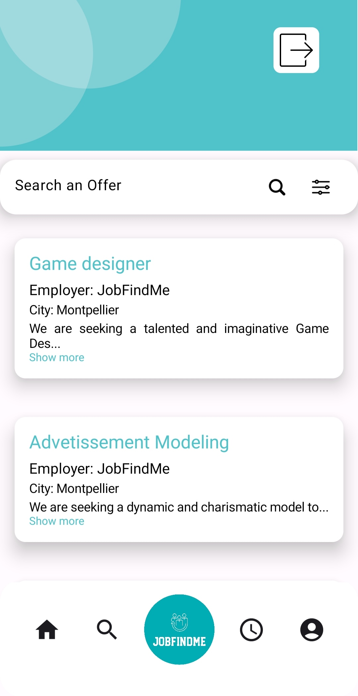

# JobFindMe

<p align="center">
	<a href="https://github.com/eric-gilles/JobFindMe">
		
	</a>
</p>

<p align="center">
	Application mobile de recherche d'emploi en intérim pour candidats et employeurs.
</p>

<p align="center">
	<a href="https://developer.android.com/studio"></a>
	<a href="https://developer.android.com/jetpack/compose"></a>
	<a href="https://kotlinlang.org/"></a>
	<a href="https://firebase.google.com/"></a>
</p>

## Sommaire
1. [Présentation](#présentation)
2. [Fonctionnalités](#fonctionnalités)
3. [Aperçu de l'application](#aperçu-de-lapplication)
4. [Ressources du projet](#ressources-du-projet)
5. [Installation et lancement](#installation-et-lancement)
6. [Auteurs](#auteurs)

## Présentation
JobFindMe est une application Android qui facilite la mise en relation entre candidats et employeurs dans le secteur de l'intérim.

L'application permet de :
- consulter des offres d'emploi,
- publier et gérer des offres côté employeur,
- postuler rapidement,
- suivre les candidatures et les réponses.

## Fonctionnalités
- Inscription et connexion utilisateur
- Connexion anonyme
- Récupération de mot de passe
- Consultation et recherche d'offres
- Postulation à une offre
- Gestion des candidatures envoyées et reçues
- Création, modification et suppression d'offres
- Consultation et mise à jour du profil
- Déconnexion

## Aperçu de l'application

| Écran de démarrage | Choix du profil |
| --- | --- |
|  |  |

| Connexion | Consultation des offres |
| --- | --- |
|  |  |

## Ressources du projet
- Code source : [github.com/eric-gilles/JobFindMe](https://github.com/eric-gilles/JobFindMe)
- Vidéo de présentation : [youtu.be/JLtRT4H6frg](https://youtu.be/JLtRT4H6frg)
- Maquette Figma : [JobFindMe sur Figma](https://www.figma.com/file/ZSaZGAQnrBKZwlQBm2vPVy/JobFIndMe?type=design&node-id=19%3A3904&mode=design&t=P7U5cbIjrOScRDN7-1)

## Installation et lancement
1. Cloner le projet :

```bash
git clone https://github.com/eric-gilles/JobFindMe
```

2. Ouvrir le dossier du projet dans Android Studio.
3. Configurer Firebase (fichier de configuration et services).
4. Synchroniser Gradle.
5. Lancer l'application sur un émulateur ou un appareil Android.

## Auteurs
- [Éric GILLES](https://github.com/eric-gilles)
- [Morgan NAVEL](https://github.com/MorganNavel)
